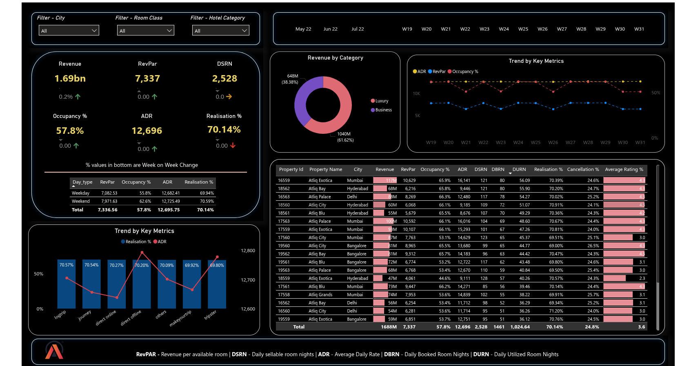

# Project-Revenue Insights - Hospitality-Domain

## Link to my Dashboard
🔷Novypro Dashboard - 

🔷Power BI Service  - 
## Overview:
*Project: Provide Insights to the Revenue team in the Hospitality Domain.*

*Domain: Hospitality Domain*

*Function: Revenue*

## Domain:  Hospitality | Function: Revenue

*AtliQ Grands owns multiple five-star hotels across India. They have been in the hospitality industry for the past 20 years. Due to strategic moves from other competitors and ineffective decision-making in management, AtliQ Grands are losing its market share and revenue in the luxury/business hotels category. As a strategic move, the managing director of AtliQ Grands wanted to incorporate “Business and Data Intelligence” to regain their market share and revenue. However, they do not have an in-house data analytics team to provide them with these insights.*

## Problem Statement:

*The revenue management team had decided to hire a 3rd party service provider to provide them with insights from their historical data.*

 ## Task:

*As an data analyst who has been provided with sample data and a mock-up dashboard to work on the following task.*

*- Create the metrics according to the metric list.*

*- Create a dashboard according to the mock-up provided by stakeholders.*

*- Create relevant insights that are not provided in the metric list/mock-up dashboard.*

## Tools Used:

*Excel: For Data Cleaning*

*Microsoft PowerPoint: For Presenting Insights*

## Key Insights:

*Checking at weekday, Weekend Table For ADR, RevPAR,Occupancy%,we could conclude that overall hotels are not changing the price between weedays and weekends.
There is an Potential Oppurtunity to generate income, by changing Price between weekday and weekends, which most of the hotels have not adopted.*

*The Fluctuation in ADR remains same over the time which is directly proportional to pricing ,Occupancy % is seen increasing Marginally,Revpar varies in linear with Occupancy % . This shows that the revenue growth over time is only due to its increase in occupancy %, and price for most of the hotels over time is almost constant, this could be an oppturnity to increase revenue through pricing*

*occupancy %  is directly proportional to Average Ratings of the Hotel, and inversely Proportional with Pricing. Hotels with less Occupancy should work on its Ratings.*

*Relization provides the details of conversion rates form booking to checkin, if the relization is low,it could be that customer is not pleased with apperance of the hotel as when compared to bokking it online.*

# Thank you.

